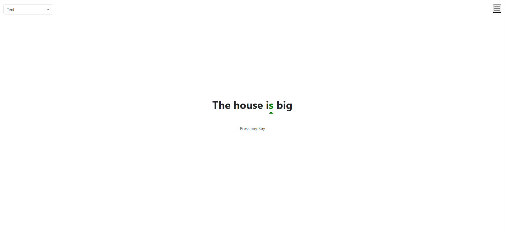
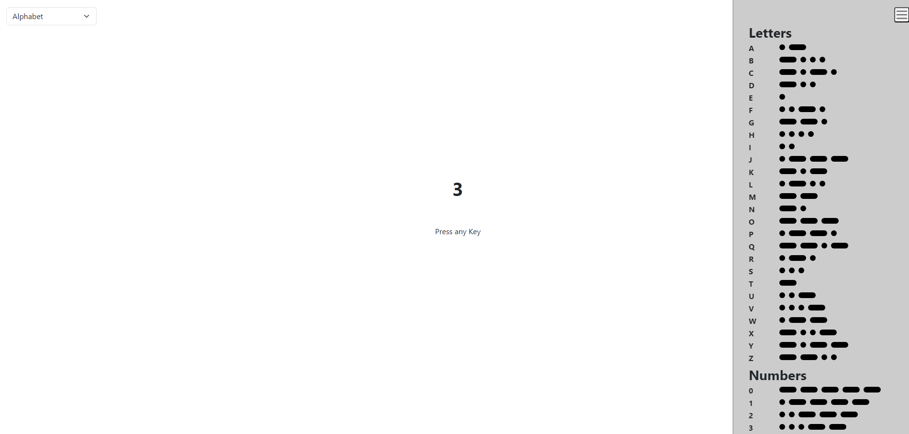

This is a very primitive morse code trainer.

# INSTALLATION
Clone the Repo, open index.html, learn morse code

# FEATURES
## Build-in Morsecode Cheatsheet
> A Cheatsheet can be toggled via a click of a button
## Random Mode
> Random Characters Appear -> Great for building single character speed
## Alphabet Mode
> Characters appear in order of the alphabet -> 0-9, A-Z
## Text Mode
> Random phrases appear, you have to translate them using morse code (Currently there are only like 30 phrases, but you can expand them in the script.js)

